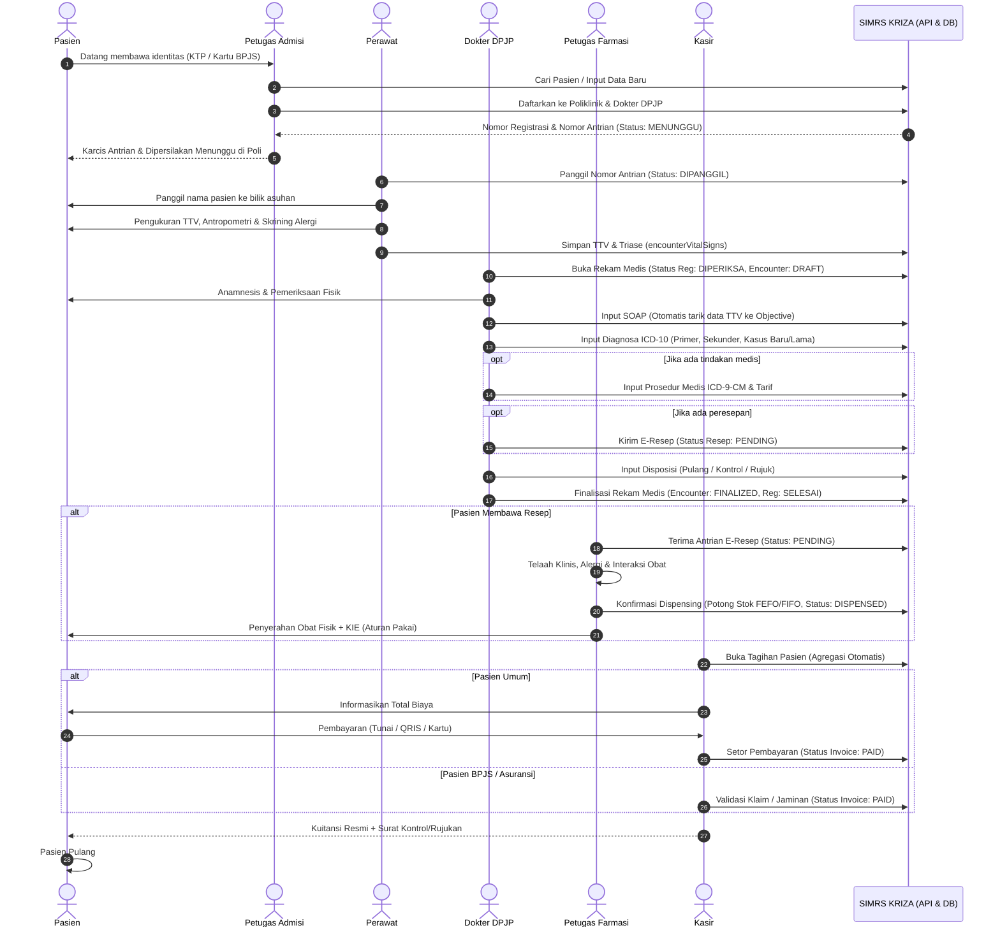

# SOP & Alur Pelayanan Pasien Rawat Jalan (SIMRS KRIZA)

> **Status Dokumen**: Spesifikasi Operasional & Desain Sistem  
> **Ruang Lingkup**: Rawat Jalan / Poliklinik (Admisi, Poli, Farmasi, Kasir)  
> **Target Pengguna**: Dokter, Perawat, Petugas Admisi, Apoteker, Kasir, & Developer SIMRS KRIZA  
> **Versi**: 1.0.0 (September 2026)  

---

## 1. Ringkasan Eksekutif

Dokumen ini menguraikan alur komprehensif pasien rawat jalan mulai dari kedatangan di faskes hingga kepulangan/selesai periksa. Alur ini mencakup integrasi operasional antar profesi (PPA - Profesional Pemberi Asuhan) dan sinkronisasi status data secara *real-time* di seluruh modul **SIMRS KRIZA** (`registrations`, `encounters`, `pharmacy`, dan `billing`).

---

## 2. Diagram Alur Pelayanan (Visual Flowchart)

```mermaid
flowchart TD
    %% Styling Node
    classDef startEnd fill:#0f172a,stroke:#334155,stroke-width:2px,color:#fff;
    classDef process fill:#1e293b,stroke:#475569,stroke-width:1.5px,color:#f8fafc;
    classDef decision fill:#334155,stroke:#64748b,stroke-width:1.5px,color:#f8fafc;
    classDef highlight fill:#0284c7,stroke:#38bdf8,stroke-width:2px,color:#fff;
    classDef success fill:#16a34a,stroke:#4ade80,stroke-width:2px,color:#fff;

    Start([Pasien Datang]):::startEnd --> Phase1[<b>FASE 1: Admisi & Pendaftaran</b><br/>Identifikasi Pasien Baru / Lama<br/>Pilih Poli, Dokter DPJP & Penjamin]:::process

    Phase1 --> PrintQueue[Cetak Nomor Antrian Poli<br/><i>Status Reg: MENUNGGU</i>]:::process
    PrintQueue --> Phase2[<b>FASE 2: Asesmen Awal & Triase</b><br/>Perawat Memanggil Pasien<br/><i>Status Reg: DIPANGGIL</i>]:::process

    Phase2 --> TTV[Pemeriksaan TTV & Antropometri<br/>TD, Nadi, Suhu, RR, SpO2, BB, TB, LP<br/>Kategori Triase: Hijau / Kuning / Merah]:::process
    TTV --> Phase3[<b>FASE 3: Pemeriksaan Dokter DPJP</b><br/>Buka Encounter Workspace<br/><i>Status Reg: DIPERIKSA</i><br/><i>Status Encounter: DRAFT</i>]:::highlight

    Phase3 --> SOAP[Pencatatan RME / SOAP<br/>• S: Anamnesis & Keluhan<br/>• O: Sinkron TTV + Fisik<br/>• A: Diagnosa ICD-10 Primer/Sekunder<br/>• P: Edukasi & Rencana Terapi]:::process
    SOAP --> ActionCheck{Ada Tindakan<br/>Medis / Prosedur?}:::decision

    ActionCheck -- Ya --> AddProc[Input Prosedur ICD-9-CM<br/>Tarif Tindakan Masuk ke Billing]:::process
    ActionCheck -- Tidak --> RxCheck

    AddProc --> RxCheck{Butuh Resep<br/>Obat?}:::decision

    RxCheck -- Ya --> CreateRx[Input E-Resep Farmasi<br/>Obat Jadi / Racikan + Signa<br/><i>Status Resep: PENDING</i>]:::process
    RxCheck -- Tidak --> Disposition

    CreateRx --> Disposition[Tentukan Disposisi / RTL<br/>• Pulang Berobat Jalan<br/>• Jadwal Kontrol Ulang<br/>• Rujuk Internal / Eksternal]:::process

    Disposition --> Finalize[<b>Finalisasi Rekam Medis</b><br/>Kunci Dokumen RME<br/><i>Status Encounter: FINALIZED</i><br/><i>Status Reg: SELESAI</i>]:::process

    Finalize --> BranchRx{Apakah Pasien<br/>Membawa Resep?}:::decision

    BranchRx -- Ya --> Phase4[<b>FASE 4: Pelayanan Farmasi</b><br/>Telaah Resep & Interaksi Obat<br/>Dispensing & Potong Stok FEFO/FIFO<br/>Cetak Etiket Aturan Pakai]:::process
    Phase4 --> DispenseDone[Penyerahan Obat + Edukasi KIE<br/><i>Status Resep: DISPENSED</i>]:::process
    DispenseDone --> Phase5

    BranchRx -- Tidak --> Phase5[<b>FASE 5: Kasir & Billing</b><br/>Agregasi Invoice Otomatis<br/>Reg + Dokter + Tindakan + Obat]:::process

    Phase5 --> PayType{Penjamin<br/>Pasien?}:::decision

    PayType -- BPJS / Asuransi --> SettleClaim[Verifikasi Jaminan / SEP<br/>Bebankan ke Penjamin<br/><i>Status Invoice: PAID</i>]:::process
    PayType -- Pasien Umum --> SettleCash[Bayar Tunai / QRIS / Transfer / EDC<br/><i>Status Invoice: PAID</i>]:::process

    SettleClaim --> PrintBill[Cetak Bukti Pembayaran / Kuitansi<br/>Serahkan Surat Kontrol / Rujukan]:::process
    SettleCash --> PrintBill

    PrintBill --> End([Pasien Pulang / Selesai]):::success
```

---

## 3. Diagram Interaksi Antar Aktor & Modul (Sequence Diagram)

---

## 4. Rincian Langkah Operasional per Tahapan

### Fase 1: Admisi & Pendaftaran (Front Office)

> [!NOTE]
> Lokasi: Loket Admisi / Pendaftaran Rawat Jalan  
> Pelaksana: Petugas Pendaftaran / Front Office  

| Aktivitas | Penjelasan Detail | Dokumen / Output |
| :--- | :--- | :--- |
| **Identifikasi Pasien** | • **Pasien Lama**: Cek nomor NIK, No. Rekam Medis (RM), atau No. BPJS. • **Pasien Baru**: Perekaman master data demografi lengkap (NIK, nama, tanggal lahir, jenis kelamin, alamat, no. HP, kontak darurat). | Master Pasien (`patients`) |
| **Penentuan Layanan** | Memilih poliklinik tujuan dan Dokter Penanggung Jawab Pelayanan (DPJP) yang sesuai jadwal praktek. | ID Poliklinik & ID Dokter |
| **Penetapan Penjamin** | • **UMUM**: Pembayaran mandiri. • **BPJS Kesehatan**: Validasi kepesertaan & surat rujukan faskes 1 / surat kontrol. • **Asuransi Swasta/Perusahaan**: Verifikasi polis jaminan. | Tipe Asuransi & No. Polis |
| **Penerbitan Antrian** | Sistem menerbitkan Nomor Registrasi (`REG-YYYYMMDD-XXXX`) dan Nomor Antrian Poli. Status: **`MENUNGGU`**. | Tiket / Karcis Antrian |

---

### Fase 2: Skrining Awal & Triase / TTV (Perawat)

> [!NOTE]
> Lokasi: Ruang Asuhan Keperawatan / Bilik Triase Poli  
> Pelaksana: Perawat Rawat Jalan  

1. **Pemanggilan Antrian**: Perawat memanggil nomor antrian pasien melalui sistem. Status antrian berganti menjadi **`DIPANGGIL`**.
2. **Pemeriksaan Tanda-Tanda Vital (TTV)**:
   - Tekanan Darah (Sistolik & Diastolik) dalam mmHg.
   - Frekuensi Nadi (*Heart Rate*) dalam x/menit.
   - Frekuensi Pernapasan (*Respiratory Rate*) dalam x/menit.
   - Suhu Tubuh dalam °C.
   - Saturasi Oksigen ($SpO_2$) dalam %.
3. **Pemeriksaan Antropometri**:
   - Berat Badan (kg) dan Tinggi Badan (cm) $\rightarrow$ Sistem menghitung nilai **IMT (Indeks Massa Tubuh)** dan kategori nutrisi secara otomatis.
   - Lingkar Perut (cm).
4. **Penilaian Klinis Awal**:
   - Tingkat Kesadaran: *Compos Mentis*, Apatis, Somnolen, Sopor, atau Koma.
   - Kategori Triase: **Hijau** (Non-Gawat), **Kuning** (Gawat Tidak Darurat), **Merah** (Gawat Darurat), atau **Hitam** (Meninggal).
   - Skrining Alergi dan Resiko Jatuh.
5. **Penyimpanan Data**: Data tersimpan ke entitas `encounterVitalSigns`.

---

### Fase 3: Pelayanan Medis di Encounter Workspace (Dokter DPJP)

> [!IMPORTANT]
> Dokter DPJP bertanggung jawab penuh atas legalitas pengisian Rekam Medis Elektronik (RME). Setelah finalisasi, rekam medis memiliki kekuatan hukum (medikolegal).

#### 1. Inisiasi Kunjungan
Dokter membuka nama pasien dari antrian poli. Sistem otomatis mengubah:
- Status Registrasi: **`DIPERIKSA`**
- Status Antrian: **`DIPERIKSA`**
- Record Encounter baru terbuat dengan status: **`DRAFT`**

#### 2. Pencatatan SOAP
- **S (Subjective)**: Keluhan utama pasien, riwayat penyakit sekarang (RPS), riwayat penyakit dahulu (RPD), riwayat penyakit keluarga, dan alergi.
- **O (Objective)**: TTV dan antropometri otomatis tersinkronisasi ke teks naratif objektif. Dokter menambahkan hasil pemeriksaan fisik umum/lokalis (*Head-to-Toe*).
- **A (Assessment)**: Diagnosis ditegakkan dengan kode **ICD-10**:
  - **Diagnosa Primer**: Wajib 1 diagnosa utama penyebab pasien berobat.
  - **Diagnosa Sekunder & Komplikasi**: Penyakit penyerta/penyulit.
  - **Kasus**: Wajib memilih **Kasus Baru** atau **Kasus Lama** (persyaratan pelaporan morbiditas RL 5.4 Kemenkes).
- **P (Plan)**: Rencana terapi, instruksi diet, anjuran istirahat, dan edukasi kesehatan.

#### 3. Prosedur & Tindakan Medis (ICD-9-CM)
Jika dokter melakukan tindakan operatif kecil, injeksi, nebulizer, atau pemasangan perban:
- Memilih tindakan dari Master Prosedur (kode ICD-9-CM).
- Tarif tindakan otomatis terhubung ke komponen tagihan (*billing*).

#### 4. Peresepan Elektronik (E-Prescription)
- Memilih obat dari master stok aktif.
- Menentukan bentuk: **Obat Jadi** (tablet/sirup) atau **Racikan** (puyer/kapsul/salep).
- Menentukan dosis, kuantitas, aturan pakai (*signa*, contoh: `3 x 1 Tablet sesudah makan`), rute pemberian (*oral*, *topikal*, dll.), serta iterasi.
- Resep terkirim ke modul farmasi dengan status **`PENDING`**.

#### 5. Rencana Tindak Lanjut (Disposisi)
Dokter menentukan arah kepulangan pasien:
1. **Pulang / Berobat Jalan**: Kondisi stabil, cukup obat jalan.
2. **Kontrol Ulang**: Pasien dijadwalkan periksa kembali pada tanggal tertentu (terbit Surat Kontrol).
3. **Rujuk Internal**: Konsultasi antar-poli spesialis dalam rumah sakit.
4. **Rujuk Eksternal**: Rujukan ke fasilitas kesehatan lanjutan (FKRTL/RS Tipe B/A) dengan catatan TACC (Time, Age, Complication, Comorbidity) untuk BPJS.
5. **Pulang Atas Permintaan Sendiri (PAPS)**.

#### 6. Finalisasi Encounter
Dokter menekan tombol **Finalisasi Rekam Medis**:
- Status Encounter terkunci menjadi **`FINALIZED`**.
- Status Registrasi dan Antrian terupdate menjadi **`SELESAI`**.
- Dokumen RME terkunci permanen; perbaikan setelah ini hanya dapat dilakukan melalui menu *Addendum/Amendment* bersertifikasi alasan.

---

### Fase 4: Pelayanan Farmasi / Depo Obat (Apoteker)

> [!NOTE]
> Lokasi: Depo Farmasi Rawat Jalan / Apotek  
> Pelaksana: Apoteker / Asisten Tenaga Kefarmasian  

1. **Penerimaan Resep**: Resep elektronik tampil di *Prescriptions Queue* dengan status **`PENDING`**.
2. **Skrining & Telaah Resep**:
   - Skrining Administrasi (identitas pasien, nama dokter, tanggal).
   - Skrining Farmasetik (bentuk sediaan, dosis, frekuensi, stabilitas).
   - Skrining Klinis (duplikasi terapi, interaksi antar-obat, riwayat alergi pasien).
3. **Dispensing & Pemotongan Stok**:
   - Sistem memvalidasi batch obat aktif dengan metode **FEFO (First Expired, First Out)** / **FIFO**.
   - Stok fisik obat dipotong secara otomatis dalam transaksi database yang aman.
4. **Pencetakan Etiket**:
   - Sistem mencetak label etiket putih (obat oral) atau biru (obat luar).
   - Memuat: Nama pasien, No. RM, tanggal, nama obat, dosis, aturan pakai, serta peringatan khusus (misal: *habiskan antibiotik*).
5. **Penyerahan & KIE (Komunikasi, Informasi, Edukasi)**:
   - Apoteker menyerahkan obat kepada pasien setelah mencocokkan identitas (nama & tanggal lahir).
   - Memberikan edukasi cara minum obat, penyimpanan, dan potensi efek samping.
   - Status resep diperbarui menjadi **`DISPENSED`**.

---

### Fase 5: Kasir, Billing & Kepulangan (Kasir)

> [!NOTE]
> Lokasi: Loket Pembayaran & Kasir  
> Pelaksana: Kasir / Petugas Keuangan  

1. **Agregasi Tagihan Terpusat**:
   Invoice pasien dihitung otomatis oleh sistem (*Single Source of Truth*):
   $$\text{Total Tagihan} = \text{Tarif Pendaftaran} + \text{Jasa Konsultasi DPJP} + \sum \text{Tindakan Medis} + \sum \text{Obat Farmasi}$$
2. **Penyelesaian Transaksi**:
   - **Pasien UMUM**:
     - Kasir mengonfirmasi rincian tagihan kepada pasien/keluarga.
     - Menerima pembayaran via Tunai, Debit/Kredit, QRIS, atau Transfer Bank.
     - Kasir menginput nominal pembayaran $\rightarrow$ Status Invoice menjadi **`PAID`**.
   - **Pasien BPJS Kesehatan**:
     - Sistem memverifikasi jaminan (klaim otomatis ditagihkan ke BPJS).
     - Jika tidak ada iur biaya/selisih kelas/obat di luar formularium, tagihan diselesaikan dengan status **`PAID` (Klaim Jaminan)**.
   - **Pasien Asuransi Swasta**:
     - Validasi *guarantee letter* (surat jaminan). Selisih ekses (jika ada) dibayarkan oleh pasien.
3. **Penerbitan Berkas Kepulangan**:
   - Petugas menyerahkan:
     1. Kuitansi Asli / Bukti Pembayaran Resmi bertanda barcode validasi.
     2. Surat Rencana Kontrol Ulang (jika ada).
     3. Surat Rujukan Eksternal beserta kelengkapan resume medis (jika dirujuk).
     4. Salinan Resep / Kartu Berobat.
4. **Pasien Pulang**: Alur pelayanan rawat jalan pasien selesai seutuhnya.

---

## 5. Matriks Sinkronisasi Status Data (State Machine)

Tabel berikut menunjukkan keterikatan transisi status antar tabel di database KRIZA pada setiap tahapan:

| Event / Tahapan | `registrations.status` | `queues.status` | `encounters.status` | `prescriptions.status` | `invoices.status` |
| :--- | :---: | :---: | :---: | :---: | :---: |
| **Pasien mendaftar di loket** | `MENUNGGU` | `MENUNGGU` | *(Belum ada)* | *(Belum ada)* | `UNPAID` |
| **Perawat memanggil pasien** | `DIPANGGIL` | `DIPANGGIL` | *(Belum ada)* | *(Belum ada)* | `UNPAID` |
| **Dokter membuka encounter** | `DIPERIKSA` | `DIPERIKSA` | `DRAFT` | *(Belum ada)* | `UNPAID` |
| **Dokter mengirim e-resep** | `DIPERIKSA` | `DIPERIKSA` | `DRAFT` | `PENDING` | `UNPAID` |
| **Dokter finalisasi RME** | `SELESAI` | `SELESAI` | `FINALIZED` | `PENDING` | `UNPAID` |
| **Farmasi serahkan obat** | `SELESAI` | `SELESAI` | `FINALIZED` | `DISPENSED` | `UNPAID` |
| **Kasir memproses bayar/klaim**| `SELESAI` | `SELESAI` | `FINALIZED` | `DISPENSED` | `PAID` |

---

## 6. Standar Pelayanan Minimal (SPM / SLA) Waktu Pelayanan

Target waktu pelayanan untuk menjaga kepuasan pasien dan mematuhi Standar Kemenkes RI:

| Tahapan Layanan | Target Waktu (SLA) | Penanggung Jawab |
| :--- | :---: | :--- |
| **Pendaftaran Pasien Lama** | $\le$ 3 Menit | Petugas Admisi |
| **Pendaftaran Pasien Baru** | $\le$ 5 Menit | Petugas Admisi |
| **Skrining & TTV Perawat** | 3 – 5 Menit | Perawat Poli |
| **Pemeriksaan Dokter DPJP** | 10 – 15 Menit | Dokter DPJP |
| **Penyiapan Obat Non-Racikan** | $\le$ 15 Menit | Farmasi |
| **Penyiapan Obat Racikan** | $\le$ 30 Menit | Farmasi |
| **Pelayanan Kasir & Pembayaran** | $\le$ 3 Menit | Kasir |
| **Total Waktu Tunggu Rawat Jalan** | $\le$ **60 Menit** *(Target SPM)* | Seluruh Tim Layanan |

---

## 7. Kebijakan Keamanan & Kepatuhan Medikolegal (Engineering Guidelines)

> [!WARNING]
> Developer dilarang membypass validasi berikut pada level API atau database trigger!

1. **Immutability Rekam Medis**:
   - Ketika `encounters.status === 'FINALIZED'`, endpoint `PUT /api/v1/encounters/:id` dilarang menerima mutasi pada data SOAP, Diagnosa, maupun Prosedur.
   - Perubahan hanya dapat diproses via endpoint `POST /api/v1/encounters/:id/amendments` dengan mencatat `userId`, `timestamp`, dan `amendmentReason` pada tabel riwayat audit (`audit_logs`).
2. **Atomicity Pemotongan Stok Farmasi**:
   - Proses update status resep menjadi `DISPENSED` dan pengurangan kuantitas stok di `drug_stocks` wajib berada dalam 1 blok **Database Transaction (`tx`)**.
   - Jika salah satu stok batch tidak mencukupi, seluruh proses *rollback* otomatis guna mencegah selisih stok fisik vs stok sistem.
3. **Pencegahan Double-Registration**:
   - Pasien yang berstatus `MENUNGGU` atau `DIPERIKSA` di poliklinik yang sama pada hari yang sama tidak dapat didaftarkan kembali tanpa flag `forceRegister=true`.
4. **Audit Trail Keuangan**:
   - Invoice yang sudah berstatus `PAID` tidak dapat dihapus (*no hard delete*).
   - Pembatalan transaksi wajib melalui mekanisme *Void Invoice* dengan persetujuan (*approval*) Supervisor Kasir.
